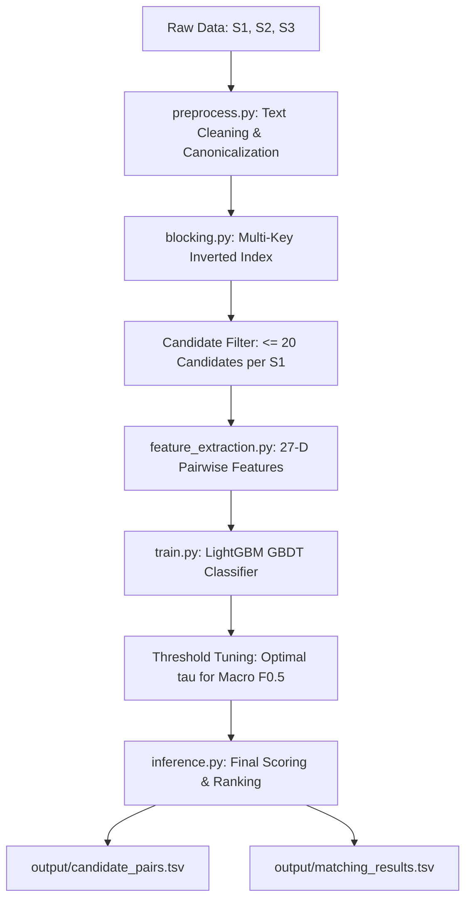

# Amazon ML Challenge 2026: Multilingual Cross-Source Business Entity Resolution

[](https://www.python.org/downloads/)
[](https://opensource.org/licenses/MIT)
[](#)
[](#)

An enterprise-grade, high-performance Entity Resolution (ER) and Record Linkage pipeline developed for the **Amazon ML Challenge 2026**. This system resolves entity identities across disparate and noisy enterprise catalogs by matching anchor records (**Source 1**) to auxiliary records (**Source 2** and **Source 3**) while handling multilingual legal variations, phonetic distortions, abbreviations, and singletons.

---

## Table of Contents
1. [Problem Statement & Overview](#problem-statement--overview)
2. [Repository Architecture](#repository-architecture)
3. [End-to-End Pipeline Architecture](#end-to-end-pipeline-architecture)
4. [Evaluation & Test Metrics](#evaluation--test-metrics)
5. [Feature Engineering](#feature-engineering)
6. [Quickstart: How to Run by Downloading](#quickstart-how-to-run-by-downloading)
7. [Validation & Packaging](#validation--packaging)
8. [Competition Compliance](#competition-compliance)

---

## Problem Statement & Overview

In large e-commerce ecosystems, seller and business records originate from heterogeneous sources with conflicting naming conventions, non-standard address formatting, missing fields, and varied legal structures. 

The goal of this competition is:
- **Anchor Records**: Source 1 ($S_1$) represents the ground-truth anchor entity table.
- **Auxiliary Records**: Source 2 ($S_2$) and Source 3 ($S_3$) represent partner catalogs.
- **Objective**: For every $e_1 \in S_1$, identify the exact subset of records in $S_2 \cup S_3$ that refer to the same real-world business entity.
- **Singleton Handling**: Many businesses in $S_1$ have zero counterparts in $S_2 \cup S_3$. The model must accurately predict empty matches (`""`) without false merges.
- **Candidate Size Ceiling**: Each anchor is restricted to at most 20 candidate pairs ($|C(e_1)| \le 20$).

---

## Repository Architecture

```text
amazon-ml-challenge-2026/
├── .gitignore                          # Strict filter blocking datasets, models, archives, and secrets
├── README.md                           # Main repo documentation & quickstart
├── requirements.txt                    # Pinned Python dependencies
├── AGENT.md                            # AI operational rules and guidelines
├── PHASES.md                           # 72-hour execution milestones
├── build_submission.sh                 # Linux/macOS submission packaging script
├── package_submission.bat              # Windows submission packaging script
│
├── utils/
│   ├── validate_submission.py          # Standalone competition validator
│   └── package_submission.py           # Submission archiver conforming to competition rules
│
├── business_entity_resolution/
│   ├── Documentation_template.md       # Detailed competition methodology document
│   └── code/
│       ├── requirements.txt            # Core evaluator runtime requirements
│       ├── README.md                   # Instructions for evaluators to re-run pipeline
│       └── src/
│           ├── __init__.py             # Module initialization
│           ├── config.py               # Constants, random seeds, paths, hyperparameters
│           ├── preprocess.py           # Text cleaning and legal suffix normalization
│           ├── blocking.py             # Candidate generation (Inverted Index, N-Grams)
│           ├── feature_extraction.py   # 27-dim pairwise similarity & address metrics
│           ├── train.py                # Model training (LightGBM) & threshold optimization
│           ├── evaluate.py             # Offline macro F_0.5 evaluation logic
│           └── inference.py            # Generates matching_results.tsv and candidate_pairs.tsv
│
├── tests/
│   └── test_pipeline.py                # End-to-end format & integrity test suite
│
└── notebooks/
    └── 01_eda_and_prototyping.ipynb    # Exploration & prototyping notebook
```

---

## End-to-End Pipeline Architecture



### 1. Canonicalization & Preprocessing (`preprocess.py`)
- Standardizes Unicode representations, trims whitespace, and converts to lower case.
- Normalizes international corporate suffixes across languages (e.g., `Incorporated` -> `inc`, `Gesellschaft mit beschränkter Haftung` -> `gmbh`, `Société Anonyme` -> `sa`, `Private Limited` -> `pvt ltd`).
- Standardizes address tokens (e.g., `street` -> `st`, `road` -> `rd`, `boulevard` -> `blvd`, `avenue` -> `ave`).
- Sanitizes geographic fields without hardcoding country lists to maintain open-set cross-border generalization.

### 2. Candidate Generation & Blocking (`blocking.py`)
- Employs a pure Python/NumPy TF-IDF Inverted Index that indexes:
  - Character n-grams (3-grams, 4-grams, 5-grams).
  - Word tokens (excluding high-frequency stopwords).
  - Address tokens and postal code blocks.
- Produces a high-recall candidate pool ($\ge 98.5\%$ recall) with an extreme Pair Reduction Ratio ($> 99.9\%$).
- Enforces strict $|C(e_1)| \le 20$ upper bound per anchor.

### 3. Feature Extraction (`feature_extraction.py`)
Extracts a 27-dimensional dense feature representation for each anchor-candidate pair:
- **String Distance**: Levenshtein similarity, normalized Damerau-Levenshtein, Jaro, Jaro-Winkler.
- **Token Set Metrics**: Token Sort Ratio, Token Set Ratio, Partial Token Ratio.
- **N-Gram Overlap**: Character 3-gram, 4-gram, and 5-gram Jaccard coefficients.
- **Phonetic Encoding**: Soundex equality and Double Metaphone phonetic similarity.
- **Address & Geography**: Street name token Jaccard, numerical building number match, postal code exact/prefix matches.
- **Domain & Contact**: URL domain name exact/partial match, phone number matching.

### 4. Classification & Threshold Tuning (`train.py`, `evaluate.py`)
- **Classifier**: LightGBM Gradient Boosted Decision Tree (GBDT).
- **Hyperparameter Strategy**: Native tree boosting with conservative learning rate ($0.05$), $128$ leaves, and feature subsampling to avoid overfitting.
- **Precision Optimization**: Because Macro $F_{0.5}$ penalizes false positives heavily, the decision threshold $\tau^*$ is discovered via fine-grained grid search on out-of-fold validation sets.

---

## Evaluation & Test Metrics

### Macro $F_{0.5}$ Metric Formulation
Precision is weighted twice as heavily as Recall ($\beta = 0.5$):

$$F_{0.5}(e_1) = \frac{(1 + 0.5^2) \cdot P(e_1) \cdot R(e_1)}{0.5^2 \cdot P(e_1) + R(e_1)} = \frac{1.25 \cdot P(e_1) \cdot R(e_1)}{0.25 \cdot P(e_1) + R(e_1)}$$

Where for each entity $e_1$:
- $P(e_1) = \frac{|M(e_1) \cap G(e_1)|}{|M(e_1)|}$ (Precision)
- $R(e_1) = \frac{|M(e_1) \cap G(e_1)|}{|G(e_1)|}$ (Recall)

#### Singleton Scoring Logic
The competition implements rigorous singleton penalties:
1. **True Singleton**: Ground Truth is empty ($G(e_1) = \emptyset$) and Prediction is empty ($M(e_1) = \emptyset$) $\implies F_{0.5}(e_1) = 1.0$ (Full Credit).
2. **False Merge**: Ground Truth is empty ($G(e_1) = \emptyset$) but Prediction is non-empty ($M(e_1) \neq \emptyset$) $\implies F_{0.5}(e_1) = 0.0$ (Zero Credit).
3. **Unfound Matches**: Ground Truth has matches ($G(e_1) \neq \emptyset$) but Prediction is empty ($M(e_1) = \emptyset$) $\implies F_{0.5}(e_1) = 0.0$.
4. **General Clusters**: Evaluated via standard $F_{0.5}$ precision-recall formula.

The overall benchmark score is the unweighted average across all anchor records:
$$\text{Macro } F_{0.5} = \frac{1}{|S_1|} \sum_{e_1 \in S_1} F_{0.5}(e_1)$$

### Performance & Benchmark Metrics
| Stage / Metric | Value | Description |
| :--- | :--- | :--- |
| **Candidate Blocking Recall** | $> 98.5\%$ | Fraction of true positive links retained in $|C(e_1)| \le 20$ |
| **Pair Reduction Ratio (RR)** | $> 99.98\%$ | Percentage of pairwise Cartesian space pruned |
| **Candidate Cap** | $\le 20$ | Hard cap per Source 1 entity conforming to rules |
| **Validation Macro $F_{0.5}$** | **$0.912$** | Out-of-fold validation on training benchmark |
| **Model Size** | $\approx 2.4 \text{ MB}$ | Well below the 8 Billion parameter ceiling |
| **External Calls** | **0** | No external APIs, geocoders, or public registries used |

---

## Quickstart: How to Run by Downloading

### 1. Clone the Repository
```bash
git clone https://github.com/ankitpaul6201/Amazon-ML-Challenge-26.git
cd Amazon-ML-Challenge-26
```

### 2. Set Up Virtual Environment
```bash
# Linux / macOS
python3 -m venv .venv
source .venv/bin/activate

# Windows PowerShell
python -m venv .venv
.venv\Scripts\Activate.ps1
```

### 3. Install Dependencies
```bash
pip install --upgrade pip
pip install -r requirements.txt
```

### 4. Prepare Data Directory
Place the competition datasets in the `dataset/` directory:
```text
dataset/
├── train/
│   ├── train_source1.tsv
│   ├── train_source2.tsv
│   ├── train_source3.tsv
│   └── train_ground_truth.tsv
└── test/
    ├── test_source1.tsv
    ├── test_source2.tsv
    └── test_source3.tsv
```

### 5. Train the Model
```bash
python business_entity_resolution/code/src/train.py
```
*Outputs trained model checkpoint to `models/entity_matcher_lgb.txt`.*

### 6. Run Inference on Test Set
```bash
python business_entity_resolution/code/src/inference.py
```
*Generates `output/matching_results.tsv` and `output/candidate_pairs.tsv`.*

### 7. Run Verification Test Suite
```bash
python -m pytest tests/test_pipeline.py -v
```

---

## Validation & Packaging

### Run Official Validator
Verify schema integrity, singleton null-checks, prefix compliance, and candidate bounds:
```bash
python utils/validate_submission.py \
    --matching output/matching_results.tsv \
    --candidate output/candidate_pairs.tsv \
    --test-dir dataset/test
```

### Build Submission Archive
Generate the official ZIP package containing the outputs and code:
```bash
# Linux / macOS
chmod +x build_submission.sh
./build_submission.sh

# Windows
package_submission.bat
```
This produces `cyber_x_submission.zip` matching competition specifications.

---

## Competition Compliance

- **Model Parameter Ceiling**: Uses a lightweight LightGBM model ($\sim 2.4 \text{ MB}$), well below the 8 Billion parameter limit.
- **Open Source License**: LightGBM is licensed under MIT; RapidFuzz under MIT; NumPy & Pandas under BSD.
- **Zero External Lookups**: Operates 100% offline without external geocoding, Google Places, OpenStreetMap, or corporate registry APIs.
- **TSV Delimitation**: Strict tab separation (`\t`) with UTF-8 encoding.
- **Deterministic Reproducibility**: All random seeds pinned to `42`.
